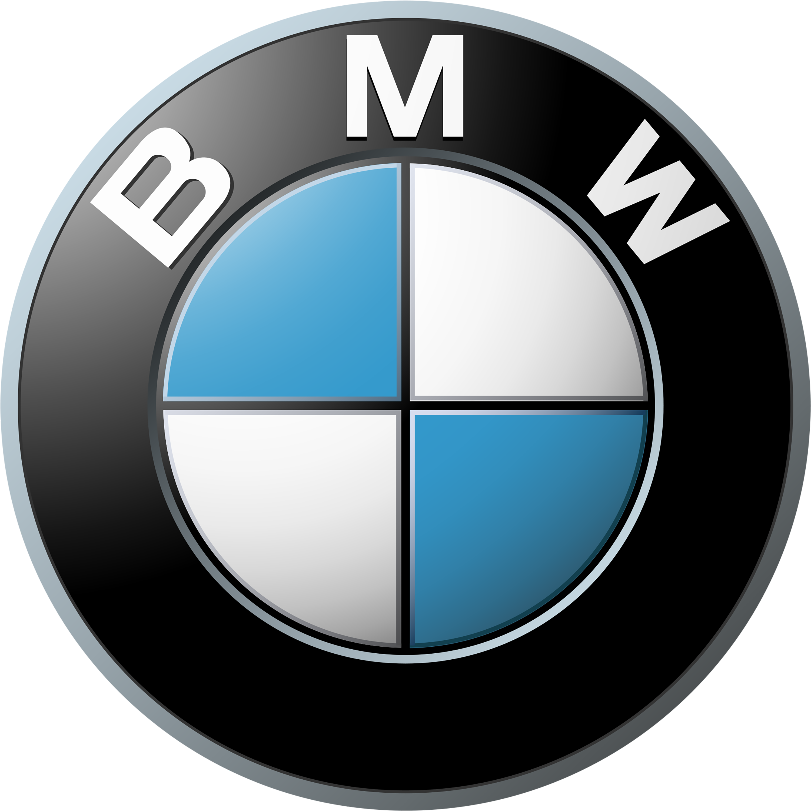

<!-- HERO LOGO SECTION -->

<p align="center">
  <!-- PLACE YOUR BMW LOGO HERE -->
  
</p>

<h1 align="center">BMW Website Clone</h1>

<p align="center">
A modern, responsive BMW website clone built with React, Vite, and pure CSS.
</p>

<p align="center">
A modern, responsive BMW website clone built with React, Vite, and pure CSS.
</p>

<p align="center">
  
  
  
  
</p>

---

## 🚗 About The Project

This project is a **clean and modern clone of the BMW official website**, developed entirely using **React + Vite** and **pure CSS**.

The main focus of this project is:

* Clean UI implementation
* Responsive design principles
* No external UI libraries
* No external fonts or CDN usage

Everything you see is handcrafted using **default system fonts** and custom CSS styling.

---

## ✨ Features

* ⚛️ Built with **React (Vite)**
* 🎨 Styled using **pure CSS only**
* 📱 Fully **responsive** (Mobile / Tablet / Desktop)
* 🚫 No external fonts or UI frameworks
* 🧼 Clean and readable code structure
* ⚡ Fast development environment with Vite

---

## 🛠 Tech Stack

* **ReactJS**
* **Vite**
* **CSS3**
* **JavaScript (ES6+)**

---

## ⚙️ Getting Started

Follow these steps to run the project locally:

### 1️⃣ Clone the repository

```bash
git clone https://github.com/USERNAME/bmw-clone.git
```

### 2️⃣ Navigate to the project directory

```bash
cd bmw-clone
```

### 3️⃣ Install dependencies

```bash
npm install
```

### 4️⃣ Run the project

**Development mode (recommended):**

```bash
npm run dev
```

**Standard start:**

```bash
npm start
```

---

## 📸 Screenshots

> You can add screenshots of the project here to showcase the UI.

---

## 📌 Notes

* No external fonts are used — the project relies on **system default fonts**.
* No UI frameworks (Bootstrap, Tailwind, etc.).
* This project is intended for **learning and practice purposes**.

---

## 👤 Author

**Shayan Taghipour**

* Frontend Developer
* React & Modern Web Enthusiast

---

⭐ If you like this project, consider giving it a star on GitHub!
